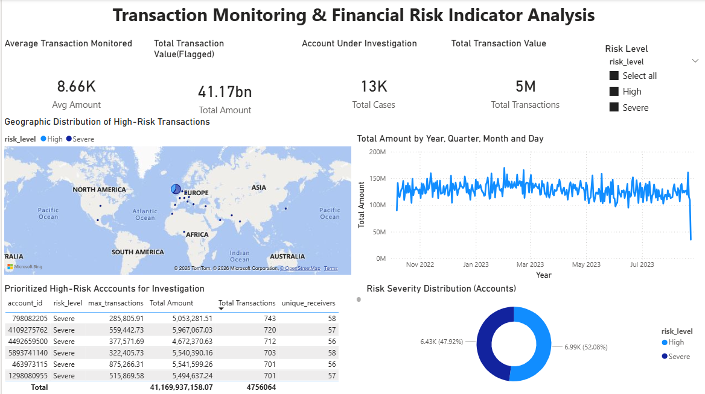
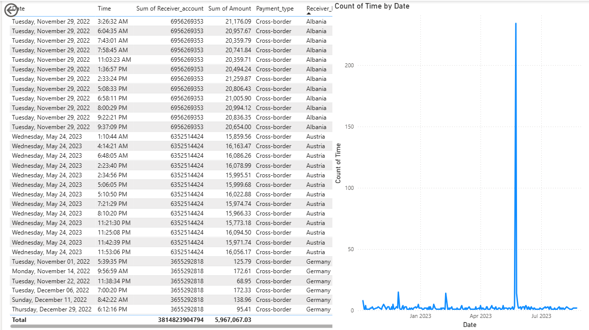

# Transaction Monitoring & Financial Risk Analysis

An **AML-style transaction monitoring and financial risk analytics system** that uses SQL-based rule scoring and Power BI to identify, prioritize, and investigate high-risk accounts in a large transaction dataset.

> **Note:** This is an analytical simulation, not a production AML/compliance system.

## 🎯 Objective

Demonstrate how a financial-risk analytics workflow can reduce a large transaction population into an investigation-focused set of accounts using **transparent, explainable rules**.

## 🧰 Tech Stack

**SQL / SQLite** · **Power BI** · **DAX** · **Data Analysis**

**Dataset:** SAML-D synthetic AML benchmark (Oztas et al.)

## 📦 Dataset Scale

- **9,504,852 transactions**
- **12 transaction features**
- Analysis period: **November 2022 – July 2023**
- **13,424 accounts** surfaced into the investigation dashboards

## 🔄 Architecture

```
SAML-D Transaction Data
        ↓
SQLite
        ↓
Rule-Based Risk Scoring
        ↓
Account Risk Categorization
        ↓
Investigation Case Output
        ↓
Power BI Dashboards
```

## 🧮 Risk Scoring

| Rule | Condition | Points |
|---|---|---:|
| High-value transaction | Any transaction > $100K | +50 |
| Very high-value transaction | Any transaction > $250K | +30 |
| High activity | More than 300 sent transactions | +40 |

Accounts scoring **80+** were surfaced as High or Severe risk for dashboard investigation.

## 📊 Dashboard

### Risk Overview


Portfolio-level monitoring of risk severity, transaction value, geographic distribution, and trends.

### Case Investigation


Account-level drill-through for transaction history, receivers, payment types, and activity patterns.

## 🔎 Key Findings

- **13,424 accounts** were classified as High or Severe risk under the project's rule model.
- Flagged transaction value totaled approximately **$41.17B**.
- High-frequency accounts showed broad receiver networks and large cumulative transaction values.
- Case-level investigation exposed repeated cross-border transfers to the same receiver that would not be captured by a single high-value transaction threshold alone.

## 🧠 Why Rule-Based Scoring?

The scoring model intentionally prioritizes **interpretability**. Each account's score can be traced directly to explicit transaction rules, making the approach easier to explain than a black-box model.

The trade-off is reduced sensitivity to complex patterns that could be captured by anomaly detection, graph analytics, or supervised ML.

## ▶️ Reproduce

1. Obtain the SAML-D dataset.
2. Load the transaction data into SQLite as `saml_d_raw`.
3. Run `risk_rules.sql`.
4. Generate the investigation outputs.
5. Open the Power BI report and connect it to the generated data.

Raw data and the full PBIX are omitted because of size.

## ⚠️ Limitations & Future Work

- Validate the rule thresholds against the dataset's `Is_laundering` ground-truth label.
- Measure precision, recall, and other classification metrics.
- Add explicit structuring / velocity rules.
- Add network/graph-based entity analysis.
- Introduce incremental or near-real-time scoring.
- Quantify geographic risk patterns rather than relying only on map visualization.

## 👩‍💻 Author

**Pranjali Sonkamble**

Interested in **Data Analytics, Financial Risk Analytics, AI/ML, and production-oriented data applications**.
